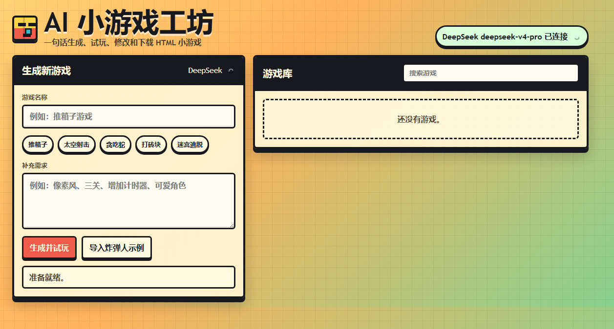

# AI 小游戏工坊

一个本地运行的 AI 网页小游戏生成器。用户输入一句游戏名称，例如“推箱子游戏”或“太空射击游戏”，后端调用 DeepSeek 生成完整 HTML 游戏，前端会用 iframe 弹窗直接试玩，并把生成结果保存在浏览器本地游戏库中。



## 功能

- 一句话生成可运行的 HTML 小游戏
- 使用 DeepSeek API，API Key 只保存在后端 `.env`
- 生成后自动弹出 iframe 试玩窗口
- 支持下载生成的 `index.html`
- 支持删除、重命名、AI 修改已有游戏
- 使用 IndexedDB 保存浏览器本地游戏库
- 显示生成进度、预计剩余时间和超时提示
- 保留已有炸弹人示例：`samples/bomberman.html`

## 文件结构

```text
.
├── index.html              # 生成器前端页面
├── server.js               # 零依赖 Node 后端
├── samples/
│   └── bomberman.html      # 已生成的炸弹人示例
├── prompt.txt              # 原始炸弹人提示词
├── .env                    # 本地 DeepSeek 配置，不要提交
└── .gitignore
```

## 环境要求

- Node.js 18 或更新版本
- DeepSeek API Key

## 配置

在项目根目录创建或编辑 `.env`：

```env
DEEPSEEK_API_KEY=你的 DeepSeek API Key
DEEPSEEK_MODEL=deepseek-v4-pro
DEEPSEEK_TIMEOUT_MS=420000
```

可选配置：

```env
PORT=8787
DEEPSEEK_BASE_URL=https://api.deepseek.com
DEEPSEEK_MODEL=deepseek-v4-pro
DEEPSEEK_MAX_TOKENS=24000
DEEPSEEK_TIMEOUT_MS=420000
```

如果希望生成更快或成本更低，可以尝试：

```env
DEEPSEEK_MODEL=deepseek-v4-flash
```

## 启动

```powershell
node server.js
```

然后打开：

```text
http://localhost:8787
```

## 使用方式

1. 在“游戏名称”中输入一句话，例如：
   - 推箱子游戏
   - 贪吃蛇游戏
   - 太空射击游戏
   - 打砖块游戏
2. 可选填写补充需求，例如：
   - 像素风，三关，有计时器
   - 可爱风格，难度逐渐增加
3. 点击“生成并试玩”。
4. 等待进度条完成后，游戏会在 iframe 弹窗中打开。
5. 可以对游戏执行：
   - 试玩
   - AI 修改
   - 下载
   - 重命名
   - 删除

## 数据保存

生成的游戏保存在浏览器 IndexedDB 中。

这意味着：

- 刷新页面后游戏库仍在
- 换浏览器或清理浏览器数据后可能丢失
- 下载过的 HTML 文件不受影响
- 删除游戏只会删除浏览器本地记录

## 安全说明

- 不要把真实 API Key 写进前端 HTML
- `.env` 已加入 `.gitignore`
- 前端只通过后端接口调用 DeepSeek
- 生成的游戏通过 `iframe sandbox="allow-scripts"` 隔离运行

## 常见问题

### 页面提示没有配置 Key

确认 `.env` 中有：

```env
DEEPSEEK_API_KEY=你的真实 Key
```

修改 `.env` 后需要重启服务：

```powershell
node server.js
```

### 生成时间很长

完整小游戏 HTML 可能比较长，生成需要等待。页面会显示估算进度和预计剩余时间。

如果经常超时，可以在 `.env` 中调大：

```env
DEEPSEEK_TIMEOUT_MS=600000
```

也可以尝试更快的模型：

```env
DEEPSEEK_MODEL=deepseek-v4-flash
```

### AI 返回内容不是完整 HTML

后端会校验返回内容必须包含 `<html>`、`<style>` 和 `<script>`。如果校验失败，前端不会覆盖原游戏，可以重新生成或补充更明确的需求。

## 示例

本项目保留了一个已成功运行的炸弹人游戏示例：

```text
http://localhost:8787/samples/bomberman.html
```
