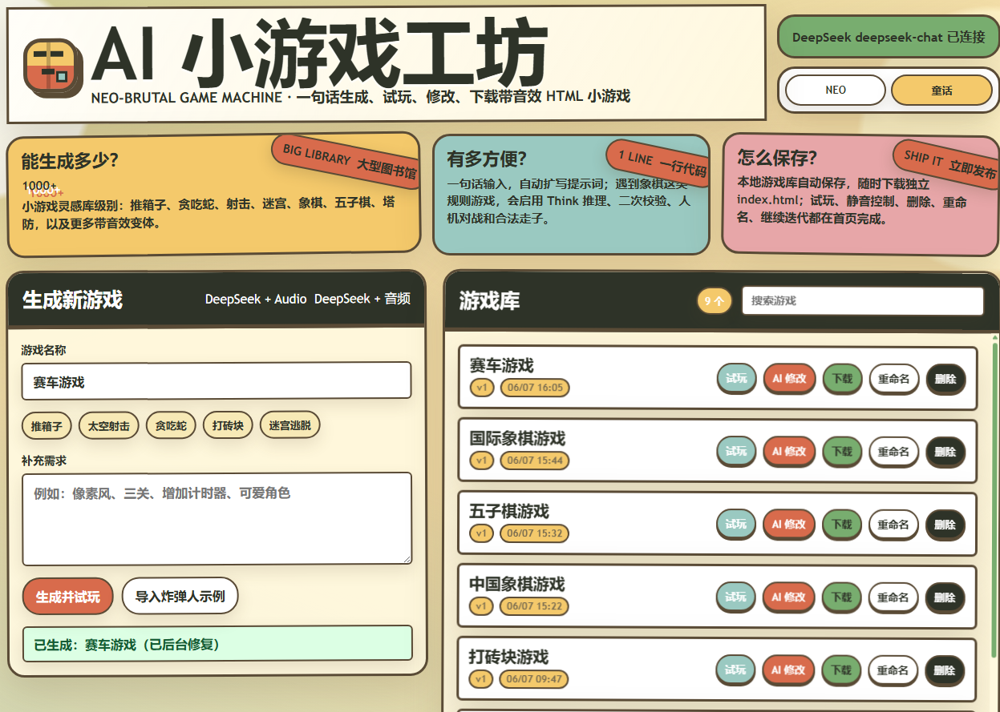

# AI 小游戏工坊

一个本地运行的 AI 网页小游戏爆款工坊。用户输入一句游戏创意，例如“画一个完美圆”或“密码规则地狱”，后端调用 DeepSeek 生成完整 HTML 游戏，前端会用 iframe 弹窗直接试玩，并把生成结果保存在浏览器本地游戏库中。生成游戏默认要求带有一句话挑战、结果卡、复制分享文案、重玩闭环和符合玩法的内嵌音效。



## 功能

- 一句话生成可运行的 HTML 小游戏
- 围绕 neal.fun 式“一句话爆点”生成可传播小游戏，而不是只堆传统玩法
- 使用 DeepSeek API，API Key 只保存在后端 `.env`
- 生成后自动弹出 iframe 试玩窗口，使用 Blob URL 兼容预览
- 支持下载生成的 `index.html`
- 支持删除、重命名、AI 修改已有游戏
- 使用 IndexedDB 保存浏览器本地游戏库
- 游戏库展示 Hook、传播标签和上次试玩结果
- 试玩窗口支持复制默认挑战文案或最新结果分享文案
- 生成游戏会通过 `postMessage` 回传结算结果，父页面自动保存到本地游戏库
- 显示生成进度、预计剩余时间和超时提示
- 每个生成游戏都会要求使用 Web Audio API 合成音效，并提供静音按钮
- 象棋、围棋、五子棋、纸牌等规则密集游戏会自动启用规则模型、Think 推理提示和二次校验
- 后台使用 Playwright 做隐藏自动试玩，发现白屏、报错或明显缺失时会尝试自动修复
- 保留已有炸弹人示例：`samples/bomberman.html`

## 文件结构

```text
.
├── index.html              # 生成器前端页面
├── server.js               # Node 后端和隐藏质量闭环
├── package.json            # 后台自动试玩依赖
├── package-lock.json
├── samples/
│   └── bomberman.html      # 已生成的炸弹人示例
├── .env                    # 本地 DeepSeek 配置，不要提交
└── .gitignore
```

运行过程中会自动生成 `server.log` 和 `quality-events.jsonl`，它们只用于本地排错和失败案例沉淀，已被 `.gitignore` 忽略。

## 环境要求

- Node.js 18 或更新版本
- DeepSeek API Key
- Microsoft Edge 或 Chrome。没有也可以运行，但后台自动试玩可能会跳过。

## 配置

在项目根目录创建或编辑 `.env`：

```env
DEEPSEEK_API_KEY=你的 DeepSeek API Key
DEEPSEEK_MODEL=deepseek-chat
DEEPSEEK_RULE_MODEL=deepseek-v4-pro
DEEPSEEK_THINKING=enabled
DEEPSEEK_REASONING_EFFORT=high
DEEPSEEK_TIMEOUT_MS=420000
SERVER_TIMEOUT_MS=1020000
```

可选配置：

```env
PORT=8787
DEEPSEEK_BASE_URL=https://api.deepseek.com
DEEPSEEK_MODEL=deepseek-chat
DEEPSEEK_RULE_MODEL=deepseek-v4-pro
DEEPSEEK_THINKING=enabled
DEEPSEEK_REASONING_EFFORT=high
DEEPSEEK_MAX_TOKENS=24000
DEEPSEEK_TIMEOUT_MS=420000
SERVER_TIMEOUT_MS=1020000
ENABLE_BROWSER_QA=true
PLAYTEST_TIMEOUT_MS=14000
NORMAL_REPAIR_LOOPS=1
RULE_REPAIR_LOOPS=2
PLAYWRIGHT_BROWSER_CHANNEL=msedge
```

普通小游戏默认使用 `DEEPSEEK_MODEL`。象棋、围棋、五子棋、纸牌等规则密集游戏会优先使用 `DEEPSEEK_RULE_MODEL`，并要求模型在内部推理后再输出代码，所以会更慢，但更适合处理棋盘布局、合法行动、人机对战和胜负判定。

如果希望普通小游戏生成更快或成本更低，可以尝试：

```env
DEEPSEEK_MODEL=deepseek-v4-flash
```

## 启动

第一次运行先安装后端依赖：

```powershell
npm install
```

启动服务：

```powershell
npm start
```

然后打开：

```text
http://localhost:8787
```

## 使用方式

1. 在“游戏名称”中输入一句话挑战，例如：
   - 画一个完美圆
   - 密码规则地狱
   - 真假 Logo 挑战
   - 颜色记忆挑战
2. 可选填写爆款补充，例如：
   - 结果越离谱越好
   - 要有百分制、称号和结果卡
   - 30 秒一局，手机也好玩
3. 点击“生成并试玩”。
4. 等待进度条完成后，游戏会在 iframe 弹窗中打开。
5. 可以对游戏执行：
   - 试玩
   - 复制分享文案
   - AI 修改
   - 下载
   - 重命名
   - 删除

## 爆款闭环

本项目参考 neal.fun 的产品路线：先让用户一听就懂，再让用户快速挑战，最后让结果值得截图和分享。后端提示词和隐藏质量检查会要求生成游戏具备：

- 首屏一句话挑战，3 秒内能理解
- 可量化结果，例如分数、正确率、用时、发现数量、称号或吐槽 verdict
- 结果卡、重玩按钮、复制/分享按钮
- 离线可用的分享文案，不依赖外部社交服务
- 结算时向父页面回传结果：

```js
parent.postMessage({
  source: "ai-game-workshop",
  type: "result",
  title,
  metric,
  shareText
}, "*");
```

父页面会把 `metric` 和 `shareText` 保存到当前游戏的 `lastResult`，并在游戏库卡片里展示。

## 规则游戏与音效

- 对象棋、中国象棋、国际象棋、围棋、五子棋、黑白棋、跳棋、四子棋、数独、麻将、纸牌等游戏，后端会自动识别为“规则密集游戏”。
- 规则密集游戏会优先走 `DEEPSEEK_RULE_MODEL`，并开启 Think/Reasoning 参数。
- 中国象棋会强制要求 9x10 交叉点棋盘、红方在下、黑方在上、正确初始布局、红方玩家 vs 黑方电脑、合法走子、吃子和胜负判定。
- 所有生成游戏都要求加入合适音效：移动、选择、吃子、射击、爆炸、收集、胜利、失败等。音效使用 Web Audio API 合成，不依赖外部音频文件。
- 浏览器限制自动播放声音，所以游戏通常会在第一次点击、按键或开始游戏后解锁音频，并提供静音按钮。

## 隐藏质量闭环

用户界面保持简单，但后端会在返回最终 HTML 前执行一条隐藏流水线：

1. 识别游戏类型，例如动作、射击、益智、迷宫、推箱子、贪吃蛇、平台跳跃、棋类、牌类。
2. 根据类型加入最低可玩标准，例如控制方式、胜负条件、重开、音效、规则校验。
3. 对 AI 返回的 HTML 做静态检查，拦截外部资源、缺少 `<style>`/`<script>`、脚本语法错误、缺少重开或静音控制等问题。
4. 检查是否具备一句话挑战、结果卡、复制/分享入口和 `ai-game-workshop` 结果回传。
5. 使用 Playwright 在后台打开游戏，检查白屏、JS 报错、画面是否可见、键盘输入和基础控件。
6. 如果问题明显，自动把内部 QA 结果发给 AI 修复。普通游戏最多修复 1 轮，规则类游戏最多修复 2 轮。
7. 质量事件会在需要时写入 `quality-events.jsonl`，用于沉淀失败案例；这些信息不会显示在游戏卡片或试玩弹窗里。

## 数据保存

生成的游戏保存在浏览器 IndexedDB 中。

这意味着：

- 刷新页面后游戏库仍在
- 换浏览器或清理浏览器数据后可能丢失
- 下载过的 HTML 文件不受影响
- 删除游戏只会删除浏览器本地记录

## 安全说明

- 不要把真实 API Key 写进前端 HTML
- `.env` 已加入 `.gitignore`
- `server.log` 已加入 `.gitignore`
- `quality-events.jsonl` 已加入 `.gitignore`
- 前端只通过后端接口调用 DeepSeek
- 生成的游戏通过 iframe 预览运行；为避开部分浏览器插件对 `about:srcdoc`/`null` origin 的干扰，当前使用 Blob URL 兼容预览
- Playwright 只用于本地后台试玩生成结果；下载出的 HTML 游戏仍是单文件、无外部依赖。

## 常见问题

### 页面提示没有配置 Key

确认 `.env` 中有：

```env
DEEPSEEK_API_KEY=你的真实 Key
```

修改 `.env` 后需要重启服务：

```powershell
node server.js
```

### 生成时间很长

完整小游戏 HTML 可能比较长，生成需要等待。页面会显示估算进度和预计剩余时间。

如果经常超时，可以在 `.env` 中调大：

```env
DEEPSEEK_TIMEOUT_MS=600000
SERVER_TIMEOUT_MS=1380000
```

`DEEPSEEK_TIMEOUT_MS` 是单次 DeepSeek 请求超时；质量闭环可能包含“生成 + 自动试玩 + 自动修复”，所以 `SERVER_TIMEOUT_MS` 应该大于 `DEEPSEEK_TIMEOUT_MS * 2`。

如果只想临时关闭后台浏览器试玩：

```env
ENABLE_BROWSER_QA=false
```

也可以尝试更快的模型：

```env
DEEPSEEK_MODEL=deepseek-v4-flash
```

### AI 返回内容不是完整 HTML

后端会校验返回内容必须包含 `<html>`、`<style>` 和 `<script>`。如果校验失败，前端不会覆盖原游戏，可以重新生成或补充更明确的需求。

## 示例

本项目保留了一个已成功运行的炸弹人游戏示例：

```text
http://localhost:8787/samples/bomberman.html
```
